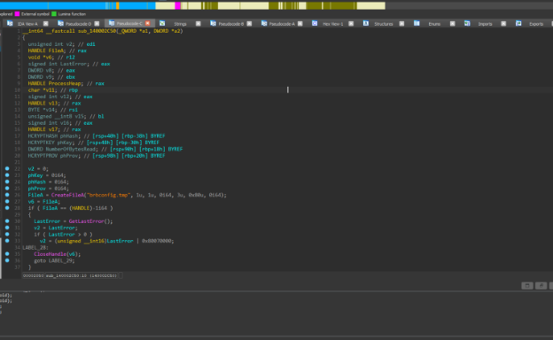

**Họ và tên: Vũ Đức Lương**

**MSV: B23DCAT177**

1. Mã độc có bị virustotal gán nhãn độc hại hay không?

Sau khi upload file lên VirusTotal chúng ta nhận được 63/73 cảnh báo đây là 1 tệp độc hại . Và đây có thể là 1 con TroJan, Ransomware.

2. Mã độc có đạt kỹ thuật persistence?

Sử dụng IDA phân tích em nhảy vào hàm sub\_140002230 để phân tích 

Em thấy được chương trình đang thực hiện 1 loạt hành động. Em chú ý đến hàm RegOpenKeyExA.

Em phân tích chương trình thì đây là việc thực hiện thêm chương trình brbbot vào registry với path 

Software\\Microsoft\\Windows\\CurrentVersion\\Run . Để khi khởi động hệ thống thì file cũng tự động chạy theo và không cần sự can thiệp từ người dùng . Đây là kỹ thuật persistence .

3. Strings của file mã độc gợi ý điều gì?

Em sử dụng công cụ IDA để view string của chương trình.

Em có để ý đến các string khá đặc biệt . Thứ nhất là string về User-Agent,các string liên quan Crypto và Hash gì đó. Các string về Http thực hiện các việc như open,send,set,connect,InternetOpenA, các string về resgister . Rất nhiều điều khả nghi chương trình kết nối mạng, đọc ghi mở file , thực hiện các request khả ghi với User-Agent, thực hiện việc connect đáng ngờ.

4. Dấu hiệu file của mã độc xuất hiện trên máy nạn nhân?

File mã độc chính là file này, và được khởi động lên trong lúc mở máy ạ. Việc nó kết nối đến trình duyệt.

5. ` `Dấu hiệu về network của mã độc?

   

Hàm này cho thấy chương trình đang kết nối đến sever, có thể lấy dữ liệu và xử lý việc gì đó.

Em đoán chương trình đang lấy dữ liệu từ Internet và thực hiện đọc ghi file khả nghi.

6. ` `Mã độc sử dụng thuật toán gì để giải mã config?

   

   Sử dụng string CryptDecrypt em tìm đến được hàm này. 

   

   Sau khi đọc code và sử dụng 1 số công cụ em nhận đợc kết quả file config này có thể đang được giải mã bằng thuật toán RC4 và khóa mã hóa được sinh ra từ băm MD5.

   Hasing with MD5:

   CryptCreateHash(phProv, 0x8003u, 0i64, 0, &phHash)

   CryptHashData(phHash, "YnJiYm90", 8u, 0)

   Key Derivation with RC4:

   CryptDeriveKey(phProv, 0x6801u, phHash, 0x800000u, &phKey)

   Decryption Process:

   CryptDecrypt(phKey, 0i64, v15, 0, v14, &NumberOfBytesRead)

7. ` `Mã độc thuộc loại mã độc nào?

Em đoán đây có thể là 1 con mã độc dạng trojan lấy dữ liệu người dùng và gửi đi ạ,  hoặc theo dõi người dùng do em thấy chương trình kết nối mạng , sử dụng WinSock . Có thể là Backdoors và người dùng có thể bị tải về các file độc hại.
